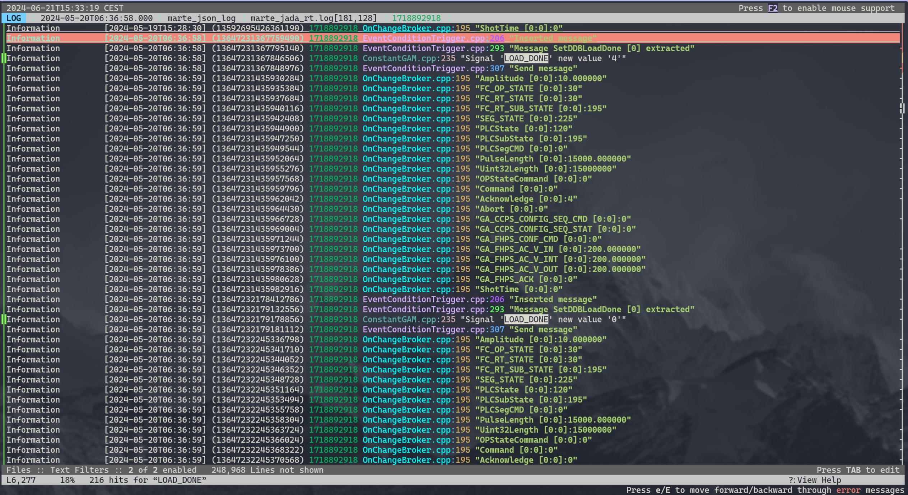

# JSONLogger

A MARTe logger that output a [`jsonl`](https://jsonlines.org/) file that can be used togheter with many standard tools.

## Configuration

The cofiguration of the logger has only 3 parameters:

| Field        | Type   | Default | Description |
|:------------:|:------:|:-------:|:------------|
| `LogPath`    | string |         | Path of the log, can be also set to `stdout` or `stderr` |
| `UniqeFile`  | bool   | `false` | if `true` the `session_id` will be added to the logpath in order to create a unique file for each execution |
| `FlushDelay` | uint32 | `1000`  | Time before flushing |

To properly set a logger in a MARTe application the `LoggerService` must be set up as following:

```json
{
    "+LoggerService": {
        "Class": "LoggerService",
        "CPUs": 1,
        "StackSize": 32768,
        "NumberOfLogPages": 100,
        "+JSONLogger": {
            "Class": "JSONLogger",
            "LogPath": "/PATH/test_log",
            "UniqueFile": false
        }
    },
    "$App" : {}
}
```

For further information please look to the [LoggerSerivce](https://vcis-jenkins.f4e.europa.eu/job/MARTe2-docs-master/doxygen/classMARTe_1_1LoggerService.html) documentation.

## Functionality

Each log event is translate in a `json` line composed with the following items:

| Key           | Type   | Descrition |
|:--------------|:------:|:-----------|
| `session_id`  | string | session identifier[^1] to enable to append multiple run to the same file |
| `timestamp`   | string | time stamp in the format `YYYY-MM-DDTHH:MM:SS` |
| `hr_time`     | uint64 | high resolution timer |
| `error_type`  | string | MARTe error type name (e.g. `FatalError`) |
| `file_name`   | string | file name source of the log |
| `line_number` | uint32 | line number source of the log |
| `message`     | string | log message (sanitized[^2]) | 


When a log is sent the `JSONLogger` wrirte it to file in a single line (as described before), 
to avoid perforamnce bottle necks the flush is managed asyncronously.


If the log file has been deleted or moved the flusher will take care to re-open it and re-create a new one.  
If it does fail, it will fall-back to `stdout`.


## Tools 

To visualize and analyse the output log it is possible to use one of the many tools that are compatible to the `jsonl` language, some of them are:
 - [`jq`](https://jqlang.github.io/jq/)
 - [`jnv`](https://github.com/ynqa/jnv)
 - [`lnav`](https://docs.lnav.org/en/latest/intro.html)

### lnav

In particular there is integration to `lnav` in form of a `lnav` format [configuration](../../Tools/marte_jsonlog.json). To install it:

```bash
lnav -i Tools/marte_jsonlog.json
```

Then to visaulize a log simply:

```bash
lnav PATH_TO_LOG
# or
lnav user@ssh_machine:PATH
```

The result should look like:

 


[^1]: The `session_id` is created in the `Initialise` method and it is simply the epoch time as string.

[^2]: The end of line are converted to `\n`, tabs to `\t` and `"` to `\"`
